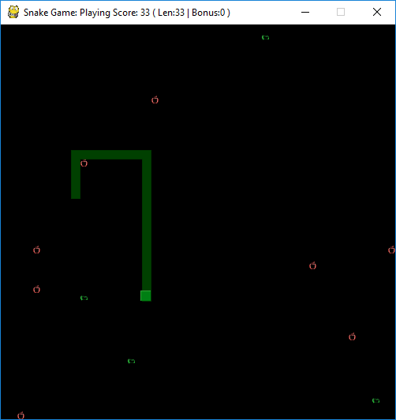

# Snake
Python Implementation of Classic Style Snake

To test my skills I made this Snake Clone in about 8 hours in one sitting. I am very pleased with the result! It probably would not have taken as long if I did not have as much fun "Testing" it.

Please do try it out and if you want play with the code some!

# Features
* [x] Controls and Rules Screens
* [x] Weighted Chance Array Controling Difficulty
* [x] 4 Apple States with difrent scoring
    * [x] Golden Apple
    * [x] Normal Apple
    * [x] Rotting Apple
    * [x] Poison Apple
* [x] tail based apple spawning
* [x] sound effects and music
* [x] game over screen semi transparent to allow player to see final state of game

# Screenshot



# Installing

Python Is required ofcourse and the pip module pygame this can be installed as below.

```
pip install pygame
```

# Author
This was all programed by in the window dicused above.